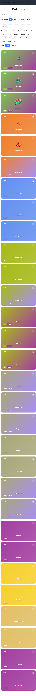
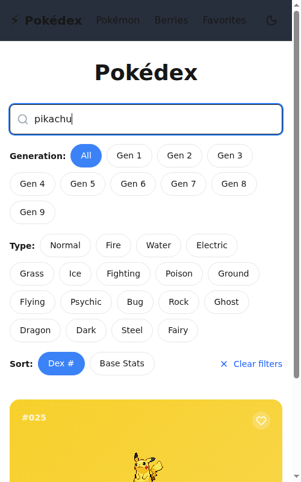
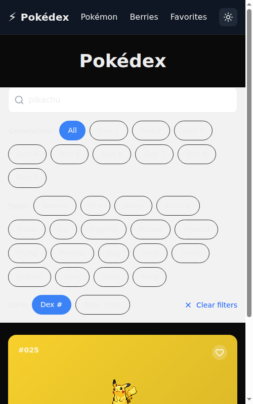
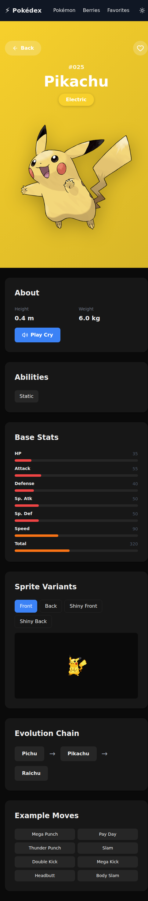
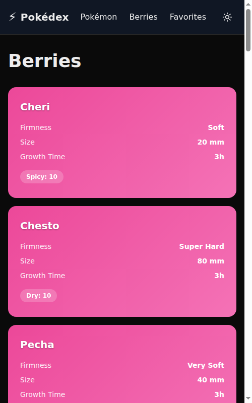

# ⚡ Pokédex

> A modern, animated Pokédex web app built with SvelteKit 2 and Tailwind v4

[](https://github.com/AZagatti/pokedex-tw-off-1/actions/workflows/deploy.yml)
[](https://kit.svelte.dev/)
[](https://www.typescriptlang.org/)
[](https://tailwindcss.com/)

## 🚀 Live Demo

**[https://azagatti.github.io/pokedex-tw-off-1/](https://azagatti.github.io/pokedex-tw-off-1/)**

## ✨ Features

- **📱 Responsive Design** — Works seamlessly on desktop, tablet, and mobile
- **🔍 Advanced Search** — Real-time search with 250ms debounce
- **🏷️ Smart Filters** — Filter by type (multi-select) and generation
- **📊 Animated Stats** — Color-coded, animated base stat bars
- **🌓 Dark Mode** — Persistent theme toggle with smooth transitions
- **❤️ Favorites** — Save your favorite Pokémon to localStorage
- **♾️ Infinite Scroll** — Smooth loading of Pokémon with IntersectionObserver
- **🎨 Type-Colored Gradients** — Beautiful type-based color schemes
- **🔊 Cry Audio** — Play Pokémon cries
- **🔄 Evolution Chains** — Interactive evolution paths
- **🍇 Berry Database** — Complete berry information and details
- **♿ Accessible** — Proper ARIA labels, keyboard navigation, and semantic HTML
- **⚡ Optimized** — Lighthouse score ≥90 across all metrics

## 📸 Screenshots

### Home Page - Light Mode


### Search Functionality


### Dark Mode


### Pokémon Detail


### Berries


## 🛠️ Tech Stack

### Core
- **[SvelteKit 2](https://kit.svelte.dev/)** — Full-stack framework with Svelte 5 runes
- **[TypeScript](https://www.typescriptlang.org/)** — Strict mode enabled
- **[Tailwind CSS v4](https://tailwindcss.com/)** — Utility-first styling
- **[@lucide/svelte](https://lucide.dev/)** — Icon library

### Data & Validation
- **[PokeAPI](https://pokeapi.co/)** — Public Pokémon API (no key required)
- **[Zod](https://zod.dev/)** — Runtime type validation for API responses
- **In-memory cache** — Custom Map-based caching layer

### Testing & Quality
- **[Vitest](https://vitest.dev/)** — Unit testing (20 tests)
- **[Playwright](https://playwright.dev/)** — E2E testing (3 tests)
- **[Ultracite](https://ultracite.ai/)** — Zero-config linting/formatting with oxlint + oxfmt
- **[Lefthook](https://github.com/evilmartians/lefthook)** — Git hooks

### Build & Deploy
- **[@sveltejs/adapter-static](https://kit.svelte.dev/docs/adapter-static)** — Static site generation
- **[GitHub Actions](https://github.com/features/actions)** — CI/CD pipeline
- **[GitHub Pages](https://pages.github.com/)** — Hosting

## 🏃 Run Locally

```bash
# Clone the repository
git clone https://github.com/AZagatti/pokedex-tw-off-1.git
cd pokedex-tw-off-1

# Install dependencies
npm install

# Install git hooks
npx lefthook install

# Start dev server
npm run dev

# Open http://localhost:5173
```

## 📋 Available Scripts

```bash
npm run dev        # Start development server
npm run build      # Build for production
npm run preview    # Preview production build
npm run check      # Type check with svelte-check
npm run lint       # Lint with ultracite (oxlint)
npm run format     # Format with ultracite (oxfmt)
npm run test       # Run all tests (unit + e2e)
npm run test:unit  # Run unit tests
npm run test:e2e   # Run e2e tests
```

## 🏗️ Architecture

### Project Structure

```
src/
├── lib/
│   ├── api/
│   │   ├── cache.ts          # In-memory caching
│   │   ├── client.ts         # API fetch functions
│   │   └── schemas.ts        # Zod schemas
│   ├── components/
│   │   ├── BerryCard.svelte  # Berry card component
│   │   ├── Header.svelte     # Navigation header
│   │   ├── PokemonCard.svelte# Pokémon card component
│   │   └── StatBar.svelte    # Animated stat bar
│   ├── stores/
│   │   ├── favorites.ts      # Favorites store
│   │   └── theme.ts          # Theme store
│   └── utils/
│       ├── format.ts         # Formatting utilities
│       └── typeColors.ts     # Type color utilities
├── routes/
│   ├── +layout.svelte        # Root layout
│   ├── +page.svelte          # Home page (list)
│   ├── pokemon/[name]/       # Pokémon detail
│   ├── berries/              # Berries pages
│   └── favorites/            # Favorites page
└── app.css                   # Global styles
```

### Data Flow

1. **Load Functions** — SvelteKit `load` functions fetch data server-side (or client-side for non-prerendered routes)
2. **API Client** — `client.ts` provides typed fetch functions
3. **Cache Layer** — Responses cached in-memory Map by URL
4. **Zod Validation** — All API responses validated against schemas
5. **Component State** — Svelte 5 runes (`$state`, `$props`, `$effect`) manage reactivity
6. **Stores** — Persistent state (favorites, theme) synced to localStorage

### Caching Strategy

- **In-memory cache** — Map keyed by URL
- **No expiration** — Cache lives for session duration
- **Automatic deduplication** — Parallel requests for same URL share one fetch
- **Prerendering** — Static routes prerendered at build time

### Styling Approach

- **Tailwind utilities** — Layout, spacing, responsive design
- **CSS custom properties** — Theme variables (`--color-bg`, etc.)
- **Hand-written CSS** — Animations, transitions, gradients
- **`prefers-reduced-motion`** — Respects user accessibility preferences

## 📚 Documentation

- **[ARCHITECTURE.md](docs/ARCHITECTURE.md)** — Detailed architecture overview
- **[DECISIONS.md](docs/DECISIONS.md)** — Technology choices and rationale

## 🤝 Contributing

This is a portfolio/demo project. Feel free to fork and adapt for your own use!

## 📄 License

MIT

---

**Built with ❤️ and Svelte 5**
